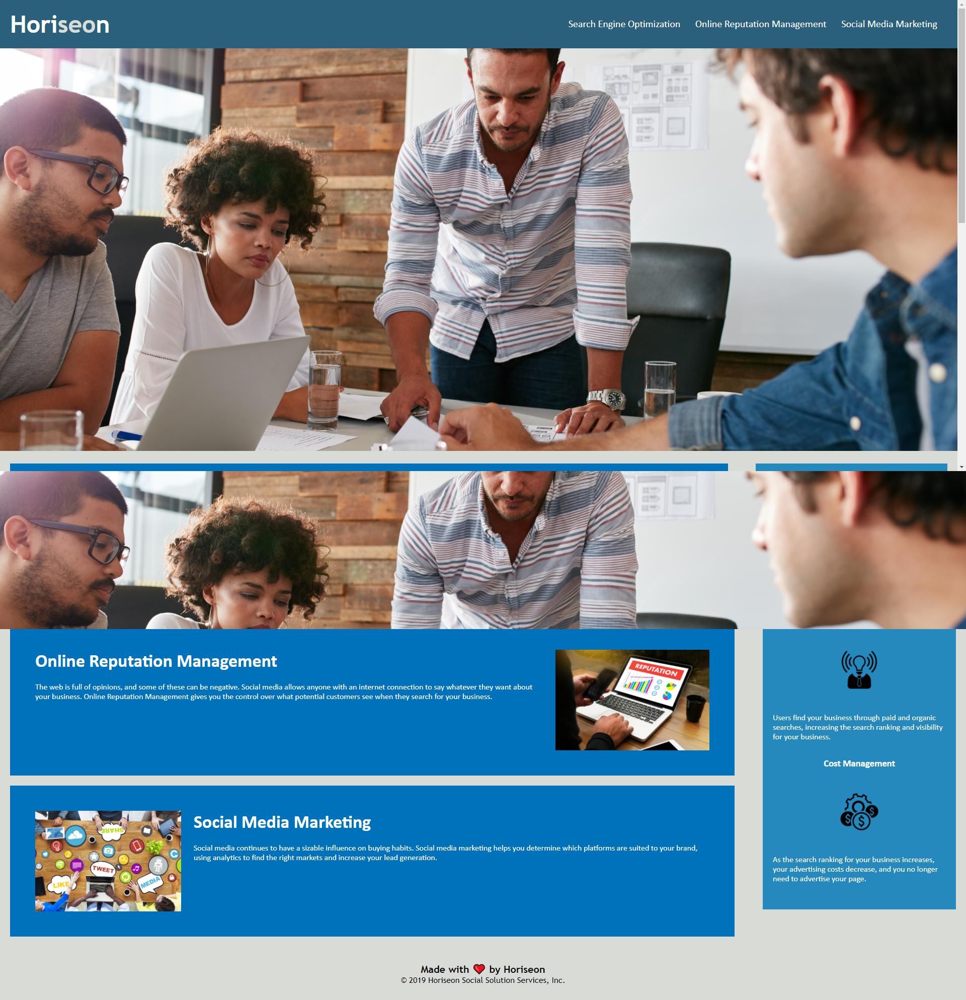

# Homework 01 - Horiseon Webpage Refactor.

## Github Pages URL:

[Click here](https://soumeyah.github.io/homework_01/) for link to github pages deployed website.

## Description:

As a marketing agency we were given the task of refactoring a webpage for Horiseon with the key focus on improving web **accessibility** and **search engine optimization**.

### What was done:

- Throughout document HTML elements were changed to semantic HTML elements.
- In the header the broken navigation link was fixed and the title was updated.
- Throughout HTML document img tags were given an alt attribute.
- A closing img tag error was removed.
- The HTML document and CSS stylesheet code were formatted using lint (prettier).
- Repeating CSS was consolidated.
- The CSS stylesheet was reorder to roughly follow HTML document layout.
- The type selector p and a were moved to higher up the stylesheet as these elements appear throughout the HTML document to make it easier for any future developer to target them.

In the future I would suggest that the website more responsive.

## Getting started:

- Clone GitHub project (repository homeworks_01) to your local machine.
- Navigate into project and open in VSCode.
- Open the index.html file in broswer preferably Chrome.

git clonegit@github.com:SoumeyaH/homework_01.git
cd homework-week-01
code .

## Screenshots:

### Before refactor:

### After refactor:

