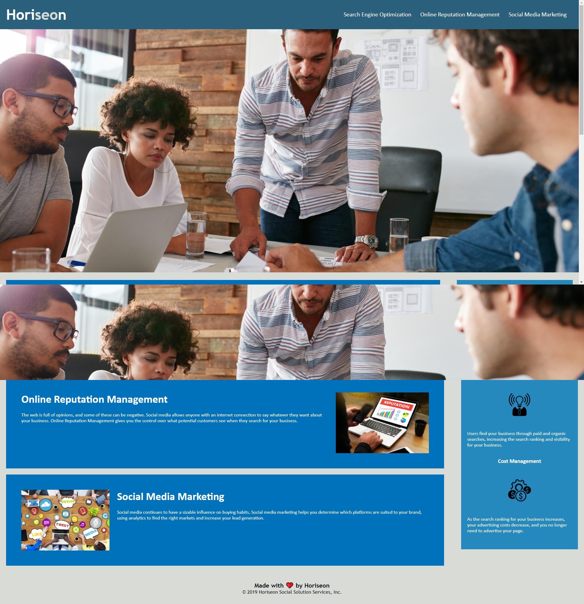

# Homework 01 - Horiseon Webpage Refactor.

## Github Pages URL:

[Click here](https://soumeyah.github.io/homework_01/) for link to github pages deployed website.

## Description:

As a marketing agency we were given the task of refactoring a webpage for Horiseon with the key focus on improving web **accessibility** and **search engine optimization**.

### What was done:

- Throughout document changed HTML elements to semantic HTML elements
- In header fixed the broken navigation link and updated title of webpage
-
- Formatted code using lint (prettier)

  make document so using semantic html and including alt attribute to img elements
  edited bugs and errors fixed broken link, removed closing tag for img

  moved a and p to top as they are type selectors found throughout document. make it easier to target in the future for another developer.

formatted code using lint (prettier)

In the future I would suggest that the website more responsive.

## Getting started:

- Clone GitHub project (repository homeworks_01) to your local machine.
- Navigate into project and open in VSCode.
- Open the index.html file in broswer preferably Chrome.

git clonegit@github.com:SoumeyaH/homework_01.git
cd homework-week-01
code .

## Screenshots:

### Before refactor:

### After refactor:

